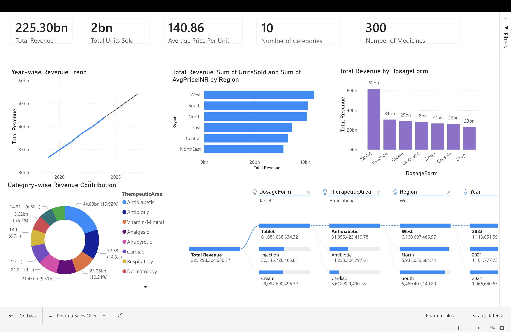

# 📊 Pharmaceutical Sales Analysis and Forecasting (Power BI)

## 📌 Overview

Performed end-to-end analysis of pharmaceutical sales data in India (2015–2024) to identify market trends, regional demand, and product performance. Built an interactive Power BI dashboard with forecasting to support data-driven decision-making.

---

## 🛠️ Tools Used

* Power BI  
* Excel / CSV dataset  

---

## 📊 Key Steps
  
* Analysis of sales across regions, drug categories, and dosage forms  
* Trend analysis of year-wise revenue  
* Dashboard development with interactive visualizations  
* Forecasting future sales trends  

---

## 📈 Key Insights

* India’s pharmaceutical market showed steady growth, reaching ₹225+ billion (2015–2024)  
* Tablets generated the highest revenue, followed by injections and creams  
* Western and Southern regions contributed the largest share of revenue  
* Therapeutic areas like analgesics, antibiotics, and cardiac drugs accounted for over 50% of total sales  

---

## 📊 Dashboard Features

* Year-wise revenue trends  
* Regional sales comparison  
* Category-wise revenue contribution  
* Dosage form performance  
* Product-level insights  

---

## 📸 Dashboard Preview

---

## 📂 Files in this Repository

- `Pharma_sales.pbix` → Power BI dashboard file  
- `Sample_pharma_dataset.csv` → Sample dataset (200 rows)  
- `Sales_dashboard.png` → Dashboard screenshot  

---

## 🚀 Outcome

Developed an interactive dashboard to analyze market performance, identify growth opportunities, and support strategic decision-making in the pharmaceutical industry.

---

📌 Note: A sample dataset (200 rows) is included for demonstration purposes due to file size constraints. The original dataset contains the complete data used for analysis.
